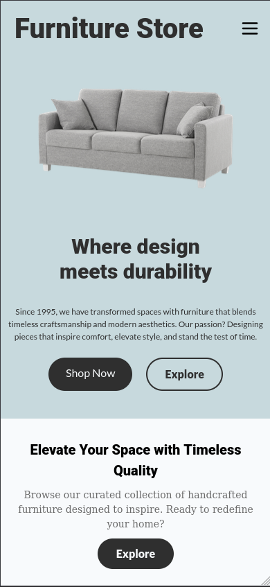
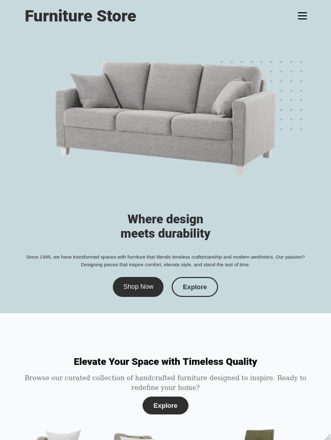
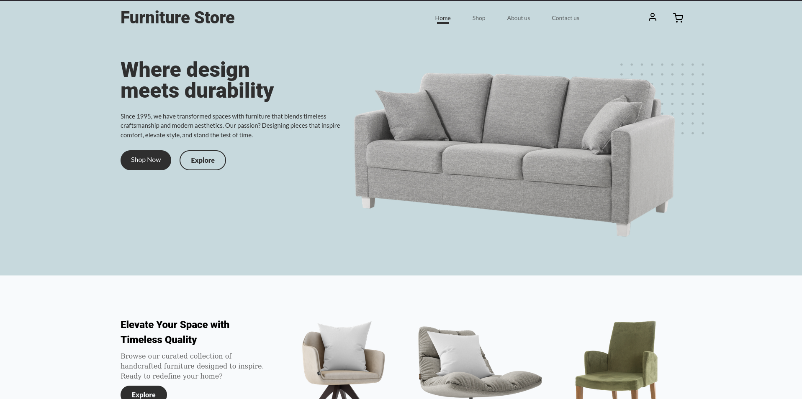
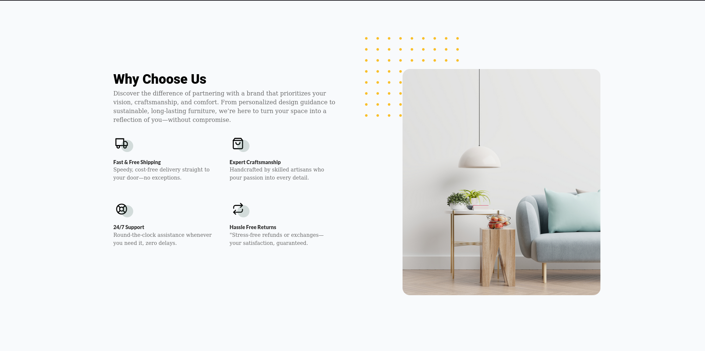
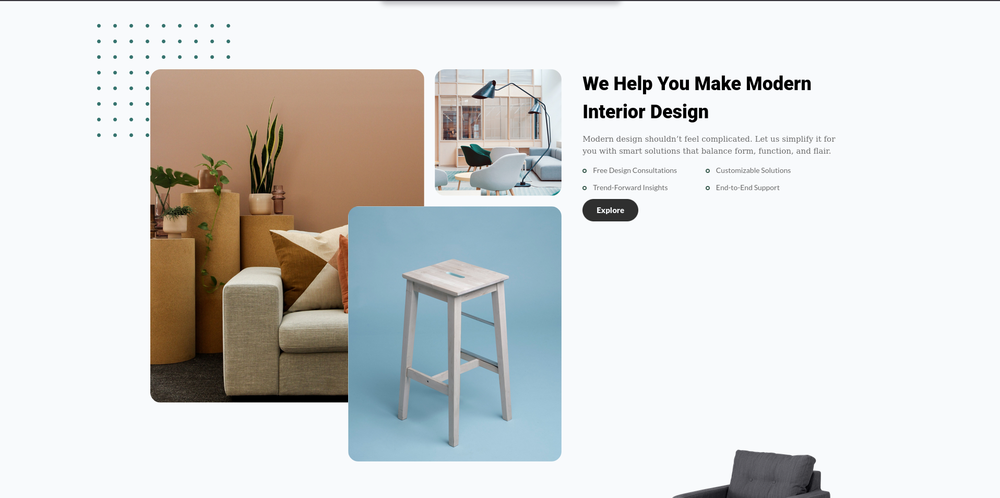
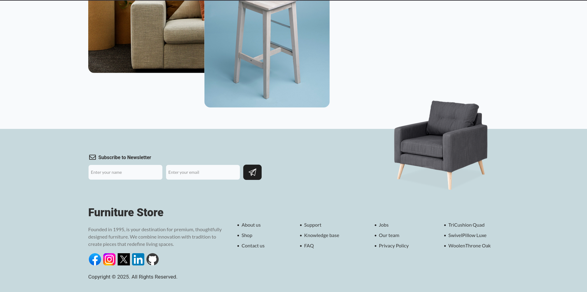

# FurnitureStore-HTML-CSS-JS

It is a Website for a Furniture Store, with navigation, animations and a beautiful design, also is a project made for practice my HTML, CSS and JS skills.

## Tech Stack

<div style="display: flex; align-items: center;">
  
  
  
</div>

## Features

- User friendly UI with a responsive layout for all devices
- Navigation between pages
- Animations on scrolling

## How to Use

```
git clone https://github.com/A4GOD-AMHG/FurnitureStore-HTML-CSS-JS.git
```

- Open index.html in your browser
- Explore the learning features presentation
- (Optional) Modify CSS styles in styles.css

## Screenshots


<!--  -->





## Author

- Alexis Manuel Hurtado García (<https://github.com/A4GOD-AMHG>)
  